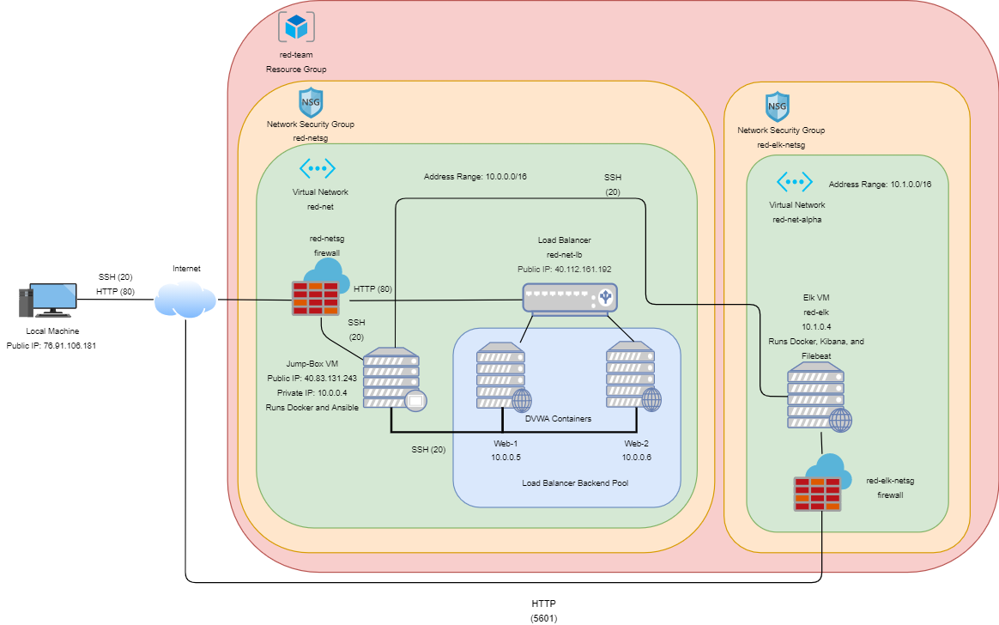
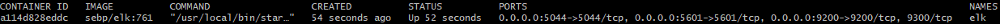

## Automated ELK Stack Deployment

The files in this repository were used to configure the network depicted below.



These files have been tested and used to generate a live ELK deployment on Azure. They can be used to either recreate the entire deployment pictured above. Alternatively, select portions of the corresponding playbook file (`filebeat-playbook.yml` file) may be used to install only certain pieces of it, such as Filebeat.

This document contains the following details:
- Description of the Topology
- Access Policies
- ELK Configuration
  - Beats in Use
  - Machines Being Monitored
- How to Use the Ansible Build


### Description of the Topology

The main purpose of this network is to expose a load-balanced and monitored instance of DVWA, the D#mn Vulnerable Web Application.

Load balancing ensures that the application will be highly redundant, in addition to restricting access to the network.
- The load balancer balances traffic between two or more machines running the same application.
- If for some reason one of the machines is taken offline or becomes unavailable, the load balancer will ensure that all future traffic will be directed to the machines that are still alive. 
- The usage of a jump box ensures that there is only one restricted entry point into the network.

Integrating an ELK server allows users to easily monitor the vulnerable VMs for changes to the logs and system metrics.

The configuration details of each machine may be found below.

| Name     | Function                      | Public IP Address | Private IP Address | Operating System    |
|----------|-------------------------------|-------------------|--------------------|---------------------|
| Jump-Box | Gateway                       | 40.83.131.243     | 10.0.0.4           | Linux               |
| red-lb   | Load Balancer                 | 40.112.161.192    | None               | Azure Load Balancer |
| Web-1    | Web Server                    | red-lb-bp         | 10.0.0.5           | Linux               |
| Web-2    | Web Server                    | red-lb-bp         | 10.0.0.6           | Linux               |
| red-elk  | Monitoring and Logging Server | 40.121.104.145    | 10.1.0.4           | Linux               |

### Access Policies

The machines on the internal network are not exposed to the public Internet. 

Only the Jump-Box machine can accept connections from the Internet. Access to this machine is only allowed from the following IP addresses:
- `76.91.106.181`

Machines within the network can only be accessed by the Jump-Box machine.
- The Jump-Box machine acts as the central hub when it comes to directly accessing every VM within the network.
- The Jump-Box's IP address is `40.83.131.243`

A summary of the access policies in place can be found in the table below.

| Name     | Publicly Accessible                       | Allowed IP Addresses    |
|----------|-------------------------------------------|-------------------------|
| Jump Box | Yes on port 22 from machines with RSA key | 76.91.106.181           |
| red-elk  | Yes on port 5601 on whitelisted machine   | 10.0.0.4, 76.91.106.181 |
| red-lb   | Yes on port 80                            | 76.91.106.181           |
| Web-1    | No                                        | 10.0.0.4                |
| Web-2    | No                                        | 10.0.0.4                |    

### Elk Configuration

Ansible was used to automate configuration of the ELK machine. No configuration was performed manually, which is advantageous because...
- The usage of Ansible to automatically configure our machines ensures that each machine is configured identically to each other and saves time in configuring each machine.

The playbook implements the following tasks:
- Install Docker.io, Python-pip3, and Docker Python module
- Raise maximum memory cap
- Download docker elk image 
- Launch a docker elk container
- Enable docker service on boot 

The following screenshot displays the result of running `docker ps` after successfully configuring the ELK instance.



### Target Machines & Beats
This ELK server is configured to monitor the following machines:
- Web-1: `10.0.0.5`
- Web-2: `10.0.0.6`

We have installed the following Beat on these machines:
- `Filebeat`
- `Metricbeat`

These Beats allow us to collect the following information from each machine:
- `Filebeat`: forwards and centralizes logs and files such as connection statistics (information such as where a connection is coming from etc).
- `Metricbeat`: records and logs system and service statistics such as resource usage.

### Using the Playbook
In order to use the playbook, you will need to have an Ansible control node already configured. Assuming you have such a control node provisioned: 

SSH into the control node and follow the steps below:
- Copy the corresponding playbook file to `/etc/ansible/` within the Ansible control node/container.
- Update the hosts file in `/etc/ansible/` within the Ansible control node/container to include the private IP addresses of the machines you wish to configure followed by `ansible_python_interpreter=/usr/bin/python3` in order to provide the path for the Ansible interpreter.
	- The IPs are to be entered on a line under their associated group (i.e. for a web server machine such as Web-1, the line `10.0.0.5 ansible_python_interpreter=/usr/bin/python3` should be placed under `[webservers]`)
	- If completed correctly, the hosts file should look like the following:
	  ```
	  [webservers]
	  10.0.0.5 ansible_python_interpreter=/usr/bin/python3
	  10.0.0.6 ansible_python_interpreter=/usr/bin/python3

	  [elk]
	  10.1.0.4 ansible_python_interpreter=/usr/bin/python3
	  ```
- Update the `ansible.cfg` in `/etc/ansible/` within the Ansible control node/container to include the username used to SSH into the corresponding machine.
	- The line `remote_user = <ssh username to access machines>` should be added/uncommented.
- Run the playbook with `ansible-playbook <name of corresponding playbook>` and navigate to http://40.121.104.145:5601/ (the public ip of the elk virtual machine on port 5601) to check that the installation worked as expected.

_As a **Bonus**, provide the specific commands the user will need to run to download the playbook, update the files, etc._